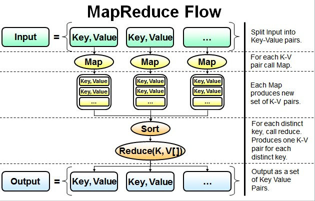
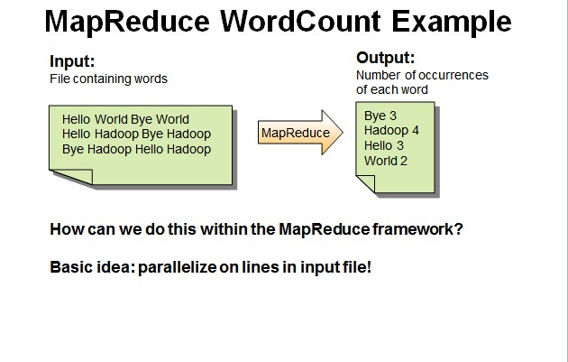
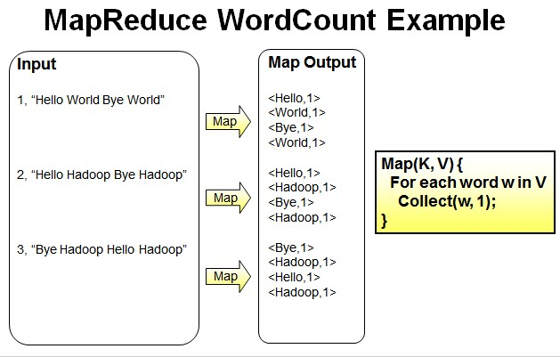

README -- LifeCat Hadoop
===============================
:elephant: :elephant: :elephant: 

|title|content|
|:---:|:---:
|desc|智能成长相册系统LifeCat-Hadoop
|author|ten
|version|Version 1
|date|2018
|framework|Hadoop
******************************************************************************

```
最简单的MapReduce应用程序至少包含 3 个部分：
一个 Map 函数、一个 Reduce 函数和一个 main 函数。
在运行一个mapreduce计算任务时候，任务过程被分为两个阶段：
map阶段和reduce阶段，每个阶段都是用键值对（key/value）作为输入（input）和输出（output）。
main 函数将作业控制和文件输入/输出结合起来。
```


#### 基于Hadoop分布式计算环境，
#### 为lifecat系统图像运算提供高性能计算环境
#### 同时对lifecat产生的数据进行处理与分析

-------------------------------
### _MapReduce提供图像运算支持_
:cloud: :cloud: :cloud: image包

-------------------------------
### _MapReduce提供数据分析支持_
:cloud: :cloud: :cloud: data包

-------------------------------
### _MapReduce开发测试Demo_
:cloud: :cloud: :cloud: text包
#### 基于MapReduce对文本文件的词频进行统计
```
并行读取文本中的内容，然后进行MapReduce操作
```

```
Map过程：并行读取文本，对读取的单词进行map操作，每个词都以<key,value>形式生成。
我的理解：

　　一个有三行文本的文件进行MapReduce操作。

　　读取第一行Hello World Bye World ，分割单词形成Map。

　　<Hello,1> <World,1> <Bye,1> <World,1>

　　读取第二行Hello Hadoop Bye Hadoop ，分割单词形成Map。

　　<Hello,1> <Hadoop,1> <Bye,1> <Hadoop,1>

　　读取第三行Bye Hadoop Hello Hadoop，分割单词形成Map。

　　<Bye,1> <Hadoop,1> <Hello,1> <Hadoop,1>
```

```
Reduce操作是对map的结果进行排序，合并，最后得出词频。
我的理解：

　　经过进一步处理(combiner),将形成的Map根据相同的key组合成value数组。

　　<Bye,1,1,1> <Hadoop,1,1,1,1> <Hello,1,1,1> <World,1,1>

　　循环执行Reduce(K,V[])，分别统计每个单词出现的次数。

　　<Bye,3> <Hadoop,4> <Hello,3> <World,2>
```


-------------------------------
## _[配置Apache Hadoop开发环境](Read/Configuration.md)_
:elephant: :elephant: :elephant: 

### Linux(ubuntu16.04)环境下配置Hadoop
#### 分布式集群主机
使用1台linux(ubuntu)系统作为集群中心，负责任务的发布

[ubuntu16配置Hadoop环境](https://blog.csdn.net/wsh596823919/article/details/80771230)

-----------------------------------
### Linux(centos7.4)环境下配置Hadoop
#### 分布式集群环境
使用2台linux(centos)系统作为分布式环境，进行分布式计算

[centos7配置Hadoop环境](https://blog.csdn.net/wsh596823919/article/details/80776007)

|主机|配置|
|---|---
|HDFS1|
|HDFS2|

-----------------------------------
### Windows10环境下配置Hadoop
#### 开发环境
在windows10环境中通过伪分布式环境进行项目的开发

[win10配置Hadoop环境](https://blog.csdn.net/wsh596823919/article/details/80774805)

-----------------------------------
  #### _@项目分析_
  
  [项目流程分析介绍](https://zhuanlan.zhihu.com/p/41211018) (点击链接)  
  
  进行了项目结构、项目目录、项目流程的分析

******************************************************************************
### 相关项目：
 #### [LifeCat version1 servlet基础Javaweb服务网站](https://github.com/kevinten10/lifecatweb)
 #### [LifeCat version2 version1相应SSM后台管理系统](https://github.com/kevinten10/SSM-lifecat)
 #### [LifeCat version3 前后端分离springboot后端](https://github.com/kevinten10/springboot-lifecat)
 #### [LifeCat version3 前后端分离vuejs前端](https://github.com/kevinten10/Web-lifecat)
 *****************************************************************************
  #### [LifeCat wechat 微信小程序](https://github.com/kevinten10/WeChat-lifecat)
  #### [LifeCat android 相应Android相册应用](https://github.com/kevinten10/Android-lifecat)
  #### [LifeCat python 机器学习进行图像智能处理](https://github.com/kevinten10/Python-lifecat)

